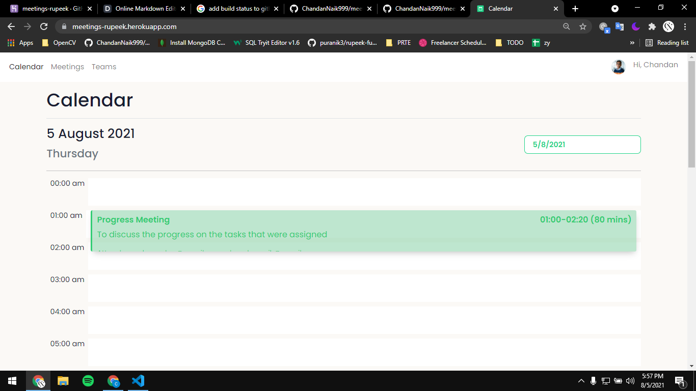
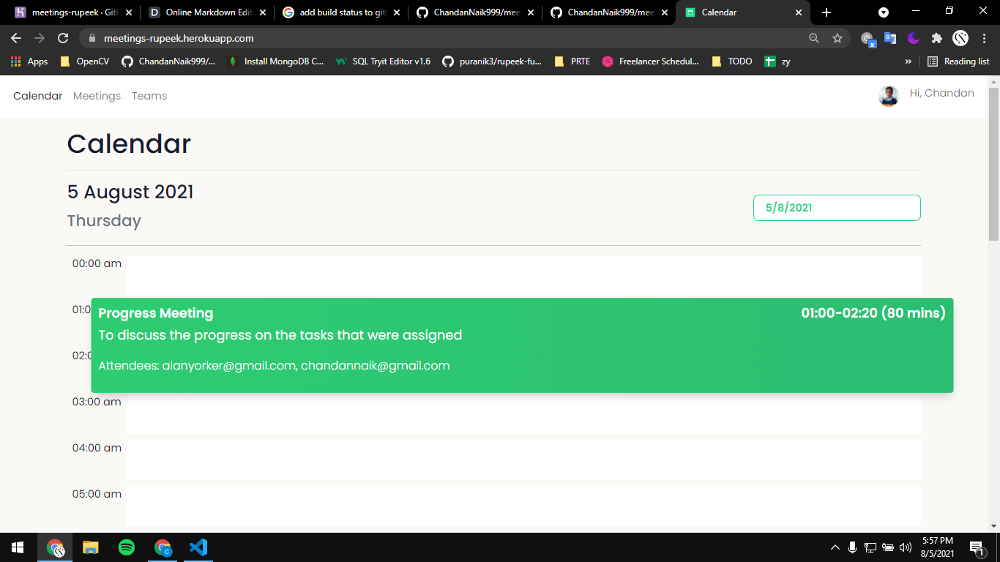
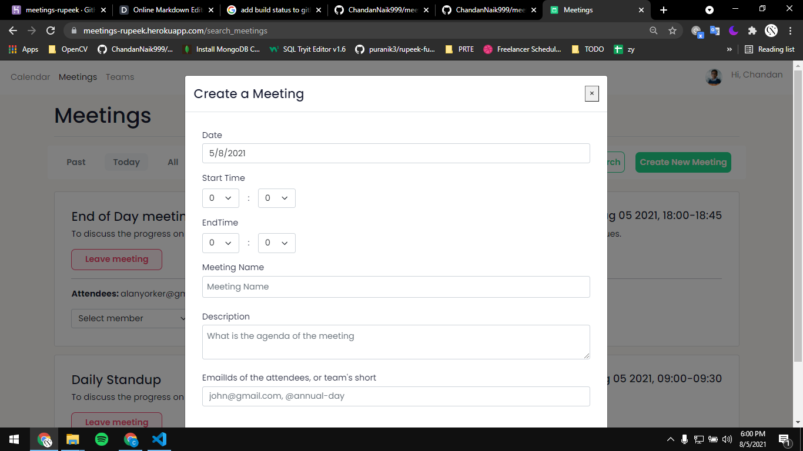
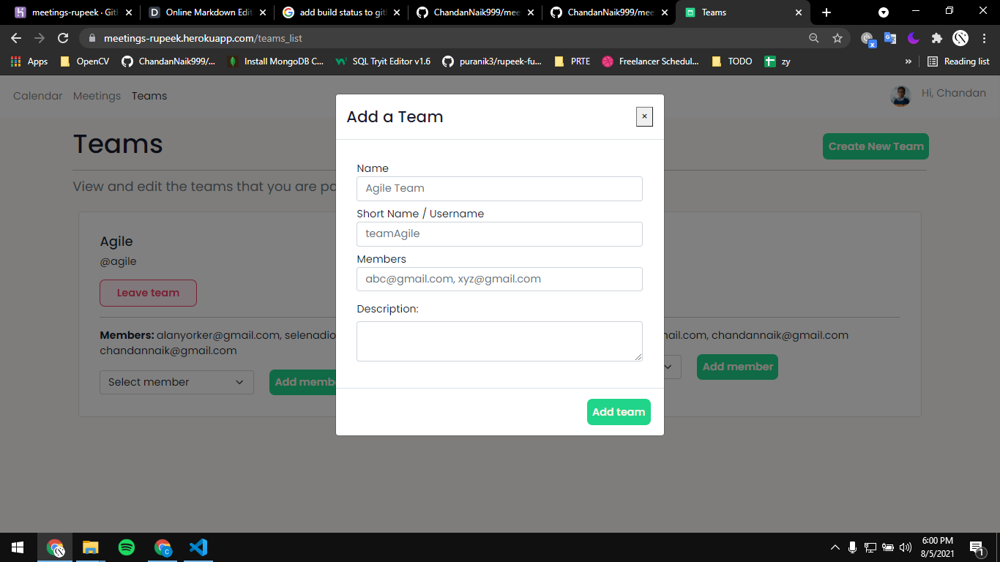
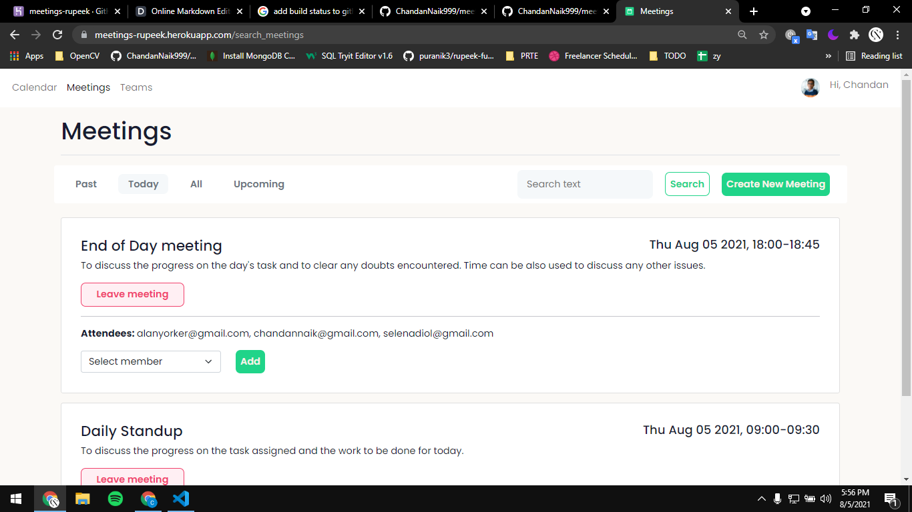
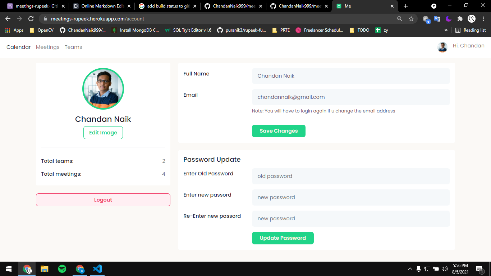

# Meetings

This project is hosted on heroku: [Live Website](https://meetings-rupeek.herokuapp.com/)
> This is a simple meetings application wherein you can organize your meetings, 
> create team, create meetings, view your calendar and other features such as 
> profile page, login, register etc. The backend for this application has been built
> using nodeJS and can be found [here](https://github.com/ChandanNaik999/meetings-server).

## Features ( FrontEnd )
- Register, Login, Form validation
- Calendar page: view your calendar, resize meetings depending on meeting duration.
- Meetings Page: Sort meetings, Search meetings, Leave a meeting, Add an attendee to a meeting
- Teams page: View your teams, Add member to a team, Leave team.
- Profile page: Edit profile image, change user details, password

## Installation

> Note: Ensure that the server application is the sibling folder of this application. 
```
npm install 
npm run build:dev
```

## Screenshots

Page Title  | Image
------------- | -------------
Register  | 
Login  | 
Home  | 
Home( On Hover )  | 
Create Meeting | 
Create Team | 
Meetings | 
Teams  | 
Profile  | 

Any queries? Email me at chandannaik999@gmail.com