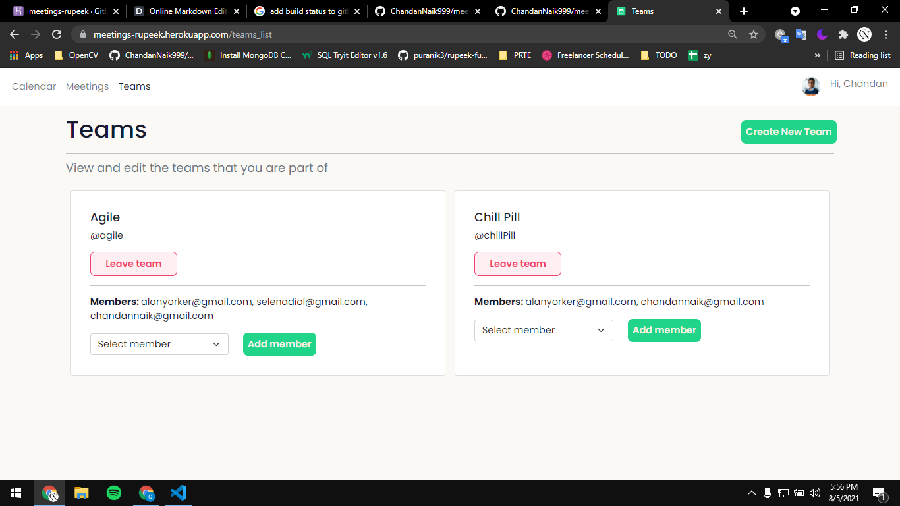

# Meetings
A simple calendar and meetings application

## Tasks

| Page Title  | UI  | Frontend( JS ) | Backend | Screenshot
| :-----------: | :---: | :-----------: | :-----------: | :-----------: |
| Register | :white_check_mark: | :white_check_mark: | :x: | 
| Login | :white_check_mark: | :white_check_mark: | :x: | 
| Home | :white_check_mark: | :white_check_mark: | :x: | 
| Add a meeting  | :white_check_mark: | :white_check_mark: | :x: | 
| Search Meetings | :white_check_mark: | :white_check_mark: | :x: | 
| Teams | :white_check_mark: | IN PROGRESS | :x: | 